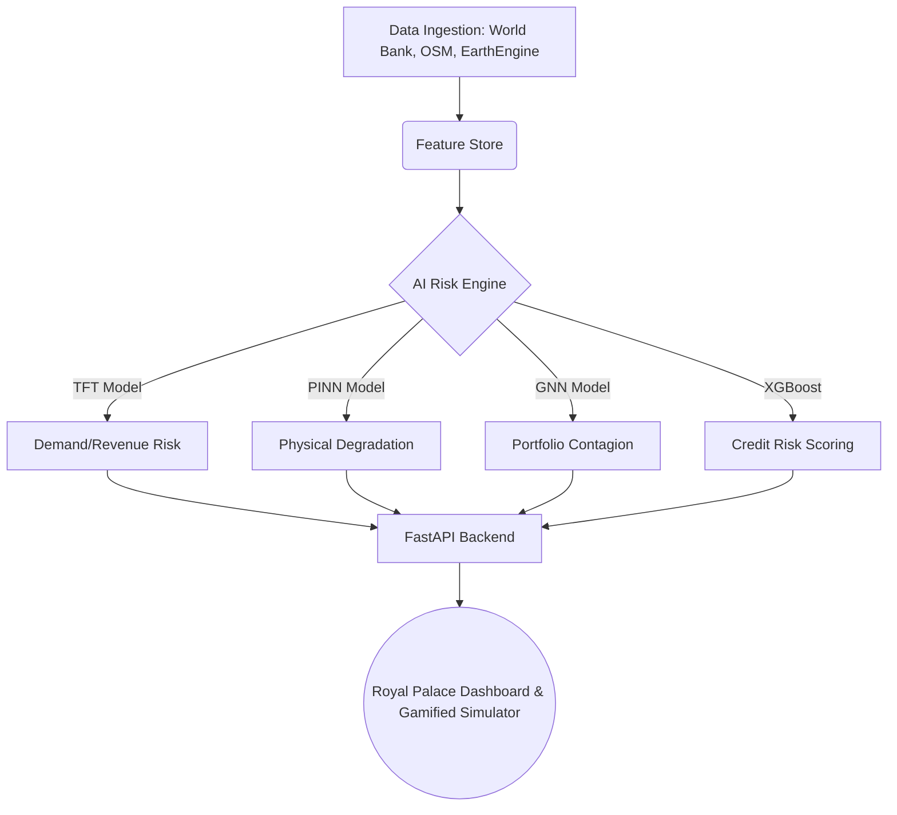

# 🏛️ InfraRisk AI


🌐 **Live Interactive Demo:** [Launch InfraRisk AI Dashboard](https://infrarisk-ai-xgwpbem8ryumo9nkxldray.streamlit.app/)

InfraRisk AI is an advanced, enterprise-grade AI system that integrates geospatial intelligence, macroeconomic modeling, construction engineering analytics, and financial risk quantification into a unified infrastructure project finance platform.

## 🚀 Quickstart (Docker Deployment)
The entire platform is fully containerized for one-command deployment:
```bash
docker-compose up --build
```
- **FastAPI Backend:** `http://localhost:8000`
- **Streamlit Royal Dashboard:** `http://localhost:8501`

## 🧠 System Architecture


## 📊 Modules Included
- **InfraRisk Lab:** A gamified simulation platform where learners manage a portfolio of infrastructure project finance deals across 30 years.
- **Credit Risk Predictor:** Live API endpoint utilizing XGBoost and PyTorch to generate Probability of Default (PD) and Credit Ratings.
- **MLOps & DVC:** Fully tracked data pipelines and model registries.
- **EDA Notebooks:** 3 comprehensive Jupyter notebooks analyzing macro, infrastructure, and satellite data.

## 📹 Video Demonstration
A 15-minute video walkthrough of the entire system architecture, the dashboard, and the AI models can be found here: [Watch the InfraRisk AI Demonstration Video](https://drive.google.com/file/d/1YfaNDBmvK62KfzHEVDyODHBJv0F77yLo/view?usp=sharing)

*Developed for the Zetheta Algorithms Private Limited Data Scientist Internship.*
